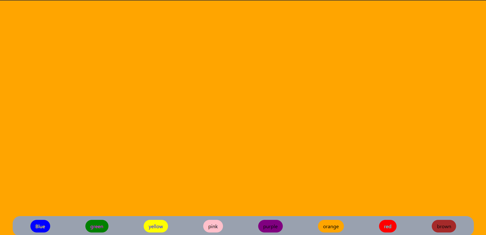

# 🎨 Adaptive Theme System

A dynamic background theme switcher built using React that adapts to user preferences and system theme settings.  
This project demonstrates real-time theme switching, system dark/light mode detection, and persistent UI preferences using localStorage.

---

## 🚀 Features

- 🎨 Custom color palette selection  
- 🌙 Automatic system dark/light mode detection  
- 💾 Theme persistence using localStorage  
- ⚡ Real-time theme updates using matchMedia API  
- 🪝 Built using React Hooks (`useState`, `useEffect`)  
- 🧠 Clean component-based architecture  
- 💅 Styled with Tailwind CSS  
- 📱 Fully responsive layout  

---

## 🛠 Tech Stack

- React  
- JavaScript (ES6+)  
- Tailwind CSS  
- Vite  
- Browser `matchMedia` API  
- localStorage  

---

## 📸 UI Preview



---

## 🧠 Learning Concepts Practiced

- Managing side effects using `useEffect`  
- Handling system theme detection  
- Working with browser APIs  
- Persistent UI state with localStorage  
- Controlled component design  
- Dynamic class handling in Tailwind  
- State-driven UI updates  

---

## 📂 Project Structure

```
adaptive-theme-system/
│
├── public/
├── src/
│   ├── components/
│   ├── App.jsx
│   └── main.jsx
├── screenshots/
│   └── adaptive-theme-system.png
├── package.json
├── vite.config.js
└── README.md
```

---

## ⚙️ Installation & Setup

Clone the repository:

```bash
git clone https://github.com/your-username/adaptive-theme-system.git
```

Navigate into the project:

```bash
cd adaptive-theme-system
```

Install dependencies:

```bash
npm install
```

Run the development server:

```bash
npm run dev
```

---


